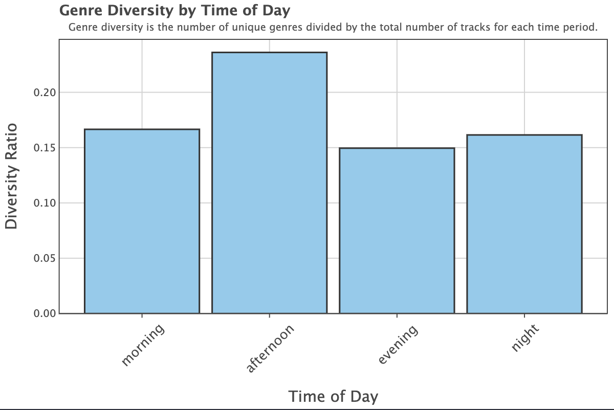

# How Music Changes Throughout the Day
**How do people's listening habits change based on the time of day?**


Spotify playlists by time of day (Mia Jaenike, Canva).

---

## **Project Overview:**
This project collects data from the Spotify API on playlists. It looks to playlists with names or descriptions that reference a specific time of day (e.g., 'Morning Wakeup', 'Afternoon Vibes', 'Night Chill') and explores their popularity and the genres of artists in their tracklists.

The goal is to uncover patterns in listening habits—whether specific genres align with different times of the day. Initially, I planned to look at specific audio features of tracks; the Spotify API was narrowed to no longer include this endpoint, so I decided to explore the genres of these playlists instead.

The findings provide insights into how music listening habits may reflect daily routines or mood changes.

---

## **Recreating the Python Environment**
#### Step 1: Create or Use an Existing Conda Environment
1. If you already have a Conda environment, activate it:
   ```bash
   conda activate <your_environment_name>
   ```

2. If you prefer to create a new Conda environment for this project:
    ```bash
    conda create -n spotify_env python=3.12.4
    conda activate spotify_env
    ```

#### Step 2: Install Required Dependencies
To install the packages, use the [requirements.txt](requirements.txt) located in the repository
```bash
pip install -r requirements.txt
```

#### Step 3: Set the .ipynb Kernel
Ensure that the Jupyter notebooks (`NB01 - Data Collection.ipynb`, `NB02 - Data Processing.ipynb`, `and NB03 - Data Visualization.ipynb`) use the same Conda environment. 

To do this:
1. **Activate Your Conda Environment**:
   - Open a terminal and activate the Conda environment:
     ```bash
     conda activate <your_environment_name>
     ```
2. **Set the Kernel in VS Code**:
   - Open your notebook in VS Code.
   - In the top-right corner of the notebook editor, look for the **Kernel Selection Dropdown**.
   - Click the dropdown and select the kernel that matches your Conda environment (e.g., `Python 3.12.4 ('spotify_env')`).

---

## **Obtaining Spotify API Credentials**
This project requires Spotify API credentials (Client ID and Client Secret) to authenticate and retrieve data from the Spotify API. Below are the steps to obtain and configure these credentials.

#### Step 1: Obtain Spotify API Credentials
1. Go to [Spotify for Developers](https://developer.spotify.com).
2. Log in and navigate to the **Dashboard**.
3. Create a new app by clicking "Create an App" and completing the form.
4. Copy the **Client ID** and **Client Secret** from the app's dashboard.

#### Step 2: Save Credentials in the `.env` File
1. In the root directory of this project, create a file named `.env` (if it doesn't already exist).
2. Add the following lines to the `.env` file, replacing `your_client_id` and `your_client_secret` with the values from Spotify:
   ```plaintext
   SPOTIFY_CLIENT_ID=<your_client_id>
   SPOTIFY_CLIENT_SECRET=<your_client_secret>
   ```

**NB:** The .env file is ignored by Git using .gitignore to ensure the credentials are not shared publicly.

#### How the Credentials Are Used
The project scripts use the credentials to authenticate with the Spotify API using a custom function get_spotify_token, located in Functions.py. This function:
- Reads the SPOTIFY_CLIENT_ID and SPOTIFY_CLIENT_SECRET from the .env file.
- Generates an access token that is used for all subsequent API requests.

---

## **How to Run the Code**
Before running any code, ensure the following Python packages are installed and loaded:

**Required Packages:**
Ensure the [requirements.txt](requirements.txt) file has been installed via pip.

1. **[Data Collection (Notebook 1):](code/NB01%20-%20Data%20Collection.ipynb)**
   - Open `code/NB01 - Data Collection.ipynb`.
   - Ensure the raw data directory (`../data/raw/`) exists. If not, create it:
     ```bash
     mkdir -p ../data/raw
     ```
   - Execute the notebook step-by-step. This notebook:
     - Authenticates with Spotify using credentials stored in `.env`.
     - Collects playlists data related to specified time periods (e.g., morning, afternoon).
     - Saves the collected data as JSON files in the `../data/raw/` directory.

Due to measures taken to avoid hitting Spotify's rate limit, the final code block of this notebook takes a long time to run (~13 mins)

2. **[Data Processing (Notebook 2):](code/NB02%20-%20Data%20Processing.ipynb)**
   - Open `code/NB02 - Data Processing.ipynb`.
   - Execute the notebook to:
     - Load raw JSON files from `../data/raw/`.
     - Clean and process the data into structured tables.
     - Save the processed data as a SQLite database in the `../data/` directory.

3. **[Data Visualization (Notebook 3):](code/NB03%20-%20Data%20Visualization.ipynb)**
   - Open `code/NB03 - Data Visualization.ipynb`.
   - Execute the notebook to:
     - Load processed data from the SQLite database.
     - Create visualizations using the `lets-plot` library to answer the research question.

---

## Results

### 1. Genres Distribution by Time of Day


- **Insight**:
   - *Pop* tracks are consistently popular throughout the day, peaking in the **evening**.  
   - *Neo mellow* and *lo-fi study* show contrasting trends, being more prominent during the **morning** and **afternoon** respectively.  
   - *Rap* gains significant popularity in the **night** period.

---

### 2. Genre Diversity by Time of Day


- **Insight**:
   - The **afternoon** period has the highest genre diversity, suggesting broader musical preferences during this time.  
   - **Morning** and **night** exhibit less diversity, with listeners favoring fewer, more dominant genres.

---

### 3. Top 10 Genres Distributed by Time of Day (Percentage)


- **Insight**:  
   - **Morning**: Genres like *pop* and *neo mellow* dominate the playlists.  
   - **Evening**: Increased representation of *lounge*, *lo-fi study*, and *pop*.  
   - **Night**: *Rap* and *lo-fi cover* tracks see greater prominence.

---

### 4. Playlist Followers Throughout the Day (Top 10 Artists)


- **Insight**:  
   - **Morning**: One Direction and The Weeknd dominate with significantly higher follower counts.  
   - **Night**: Post Malone and Justin Bieber gain traction during the night hours.  
   - Other artists exhibit lower follower engagement in the **afternoon** and **evening**, suggesting less active playlist listening.


---

### 5. Distribution of Playlist Followers by Time of Day


- **Insight**:  Playlist followers are most concentrated in the **morning** and **night** periods, with some outliers showing extremely high follower counts. **Afternoon** and **evening** periods exhibit fewer followers on average.

---

### Summary of Findings
The analysis highlights distinct patterns in listener behavior across different times of the day:
- **Morning**: High engagement with *pop* and *neo mellow*, with notable artist follower peaks.  
- **Afternoon**: Exhibits the **highest genre diversity**, with increased listening to *lo-fi study* and *lounge* genres.  
- **Evening**: Transition period with a balance of *pop*, *lo-fi cover*, and *adult standards* genres.  
- **Night**: High engagement with *rap* and *lo-fi cover*, alongside spikes in playlist followers for *Post Malone* and *Justin Bieber*.

---

## **References**
For obtaining colourblind-friendly hex codes, I referred to [The Node's Data Visualization with Flying Colors](https://thenode.biologists.com/data-visualization-with-flying-colors/research/); I used the Muted qualitative color scheme.

To include tooltips in the lets-plot visualizations, I referred to the example section of the [lets-plot documentation on using tooltips](https://lets-plot.org/python/pages/tooltips.html).

I used relative paths in this README, informed by [GitHub markdown documentation on relative links](https://docs.github.com/en/get-started/writing-on-github/getting-started-with-writing-and-formatting-on-github/basic-writing-and-formatting-syntax#relative-links).

For adding a folder for the Spotify playlist image collage, I used referred to [this Medium article](https://medium.com/@gl7526/making-a-folder-of-images-for-your-github-readme-2c6cd42e1439) and [this Geeks for Geeks guide](https://www.geeksforgeeks.org/how-to-resize-image-in-github-using-markdown/).

***

**AUTHOR:** Mia Jaenike<br>
**CONTACT:** miaajaenike@gmail.com<br>
**LAST UPDATED:**: 2024-12-11
